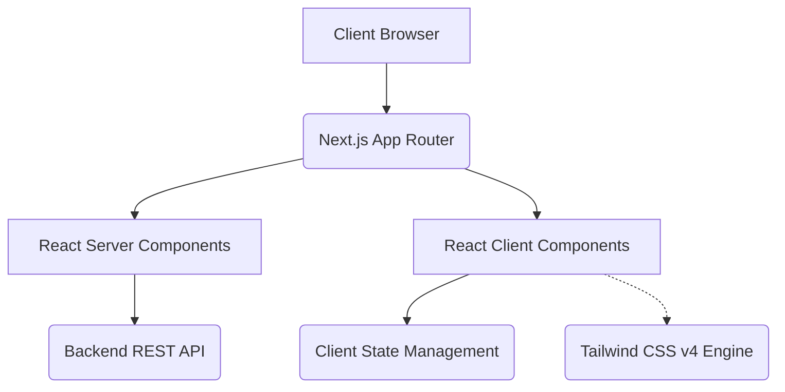

<div align="center">
  
# 🦄 Unicorn Frontend Architecture

**Next-Generation React Application Foundation**

[](https://nextjs.org/)
[](https://react.dev/)
[](https://www.typescriptlang.org/)
[](https://tailwindcss.com/)

*A blazing fast, accessible, and scalable frontend built with Next.js 16, React 19, and Tailwind CSS v4, engineered for high-performance and seamless user experiences.*

</div>

---

## 📖 Table of Contents
- [System Architecture](#-system-architecture)
- [Core Features](#-core-features)
- [Project Structure](#-project-structure)
- [Local Development Setup](#-local-development-setup)
- [Environment Configuration](#-environment-configuration)
- [Design System & UI](#-design-system--ui)
- [CI/CD & Deployment](#-cicd--deployment)

---

## 🏗 System Architecture

This application leverages the modern **Next.js App Router** paradigm, providing advanced layout composition, Server Components by default, and streamlined data fetching capabilities. It acts as the primary presentation layer, deeply integrated with the Unicorn Backend services.

### Application Flow



---

## 🚀 Core Features

- **App Router Architecture**: Utilizes Next.js 16 nested routes (`/app`) for highly optimized, layout-driven UI structures.
- **Data Visualization**: Integrated with `recharts` for dynamic, real-time data plotting and dashboard analytics.
- **Responsive & Utility-First Styling**: Powered by the cutting-edge Tailwind CSS v4 engine for instantaneous, zero-runtime styling.
- **Rich Iconography**: Implementing both `lucide-react` and `react-icons` for a scalable vector graphic pipeline.
- **TypeScript First**: Strict structural typing ensuring end-to-end type safety and robust developer experience.

---

## 📂 Project Structure

The codebase is logically segmented to enforce modularity and reusability:

```text
.
├── app/
│   ├── about-us/          # Corporate information routing
│   ├── contact-us/        # Inquiry & support forms
│   ├── dashboard/         # Analytics and user control panel
│   ├── manage-bookings/   # Booking administration interface
│   ├── product/           # Product listing & catalog
│   ├── product-details/   # Granular product inspection
│   ├── globals.css        # Global Tailwind injections
│   ├── layout.tsx         # Root server layout
│   └── page.tsx           # Entry point
├── components/            # Reusable React components (Atoms, Molecules, Organisms)
├── lib/                   # Utility functions & API clients
├── types/                 # TypeScript declaration bounds
└── public/                # Static assets (images, fonts, etc.)
```

---

## ⚙️ Local Development Setup

### 1. System Requirements
- `Node.js` >= 20.x.x (Required for Next.js 16+)
- `npm` >= 10.x.x or `pnpm` / `yarn`

### 2. Initialization
```bash
# Navigate to the frontend directory
cd unicorn

# Resolve dependencies (Clean install)
npm ci
```

---

## 🔧 Environment Configuration

A `.env.local` file is required for running the application. It maps to backend services and handles client-side keys.

```env
# Application Settings
NEXT_PUBLIC_APP_URL="http://localhost:3000"

# Backend API Bindings
NEXT_PUBLIC_API_BASE_URL="http://localhost:3000/api/v1"

# Telemetry/Analytics (If applicable)
NEXT_PUBLIC_ANALYTICS_ID="<your_analytics_hash>"
```

---

## 🎨 Design System & UI

This project employs a robust UI configuration mapped through **Tailwind v4**.
- **Icons**: Sourced from `Lucide` and `react-icons` for comprehensive coverage.
- **Charts**: Built via `recharts` to render scalable SVG analytics.
- **Styling Pipeline**: Global PostCSS parsing mapped directly into `globals.css` with a focus on modern CSS nesting and hardware-accelerated transitions.

---

## 🚢 CI/CD & Deployment

The application is heavily optimized for edge networks and Vercel-like deployment architectures.

### Production Compilation
Transpile the React Server Components and compile standard static assets:

```bash
# Resolve dependencies
npm ci

# Execute Next.js Compiler
npm run build

# Start the production Node server
npm start
```
